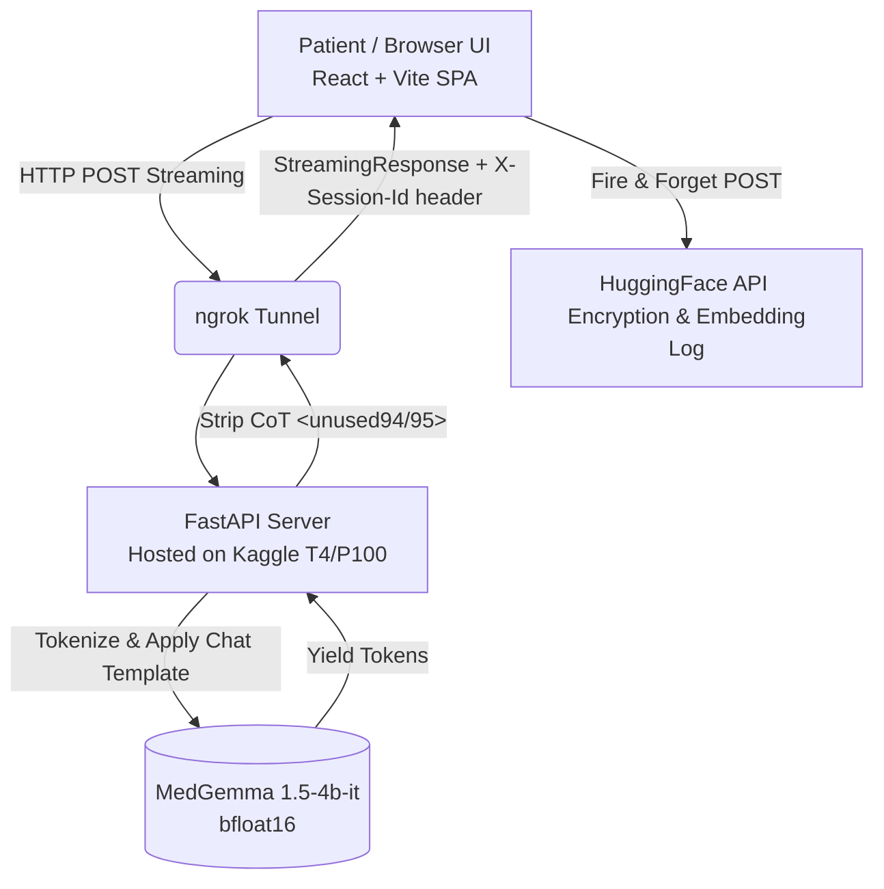

# 🩺 MedGemma Chat

**A privacy-aware, multilingual medical AI assistant utilizing latent chain-of-thought reasoning.**

[](https://medgemma-brown.vercel.app/)
[](https://vimeo.com/1167562796?fl=ip&fe=ec)
[](https://kaggle.com/code/nlashraf/med-try)

**MedGemma Chat** is an official submission for the [Google Health AI Developer Foundations (HAI-DEF) Kaggle Hackathon](https://www.kaggle.com/competitions/medgemma-impact-challenge).

It provides a secure, highly responsive streaming interface for patients to triage symptoms using `google/medgemma-1.5-4b-it`. By deploying an open-weight model through a controlled pipeline, we solve the privacy liability of routing sensitive Protected Health Information (PHI) through closed-source APIs, while providing clinical-grade conversational AI.

---

## ✨ Key Features

* **Agentic Medical Triage:** Driven by a highly engineered system prompt, the model acts as an intelligent clinical agent. It identifies missing clinical details, limits itself to asking exactly *one* targeted follow-up question per turn to avoid overwhelming the patient, and synthesizes differential possibilities only when sufficient context is gathered.
* **Latent Chain-of-Thought (CoT) Stripping:** MedGemma 1.5 generates internal reasoning steps using `<unused94>` and `<unused95>` tokens. Our backend intercepts the token stream, strips out this raw computational logic, and delivers only the clean, finalized medical advice to the patient.
* **Privacy-First Encryption Pipeline:** In parallel with inference, every user query is sent via a fire-and-forget request to a HuggingFace API. This encrypts the payload and logs a 256-dimensional embedding, proving query auditability without exposing plaintext data.
* **Real-Time Streaming:** Built with the Web Streams API on the frontend and `TextIteratorStreamer` on the backend for ultra-low latency, token-by-token text generation.
* **Multilingual:** Inherits MedGemma's robust pre-training, allowing it to accurately assess symptoms provided in multiple languages (e.g., Bengali) without relying on external translation APIs.

---

## 🏗️ System Architecture

Our solution is divided between a lightweight frontend SPA and a GPU-accelerated backend inference server.



---

## 💻 Tech Stack

| Layer | Technology |
|---|---|
| **Frontend** | React 19, Vite 7, Vanilla CSS, lucide-react, react-markdown |
| **Backend** | FastAPI, Python, `transformers`, `TextIteratorStreamer`, ngrok |
| **AI / ML** | `google/medgemma-1.5-4b-it`, HuggingFace Spaces (encryption logging) |
| **Infrastructure** | Kaggle Notebooks (GPU), Vercel (frontend hosting) |

---

## 🚀 How to Run Locally

Because the model requires a GPU for real-time inference, the backend is designed to run in a Kaggle notebook environment, while the frontend can be run anywhere.

### 1. Start the Backend (Kaggle)

1. Open the [Kaggle Notebook Backend](https://kaggle.com/code/nlashraf/med-try).
2. Start the notebook session — ensure the **GPU T4 x2** or **P100** accelerator is enabled.
3. Run all cells to spin up the FastAPI server. The final cell will output an ngrok public URL. Keep this URL handy.

### 2. Start the Frontend (Local)

Clone this repository:

```bash
git clone https://github.com/shakibul22/medgemma.git
cd medgemma
```

Install dependencies:

```bash
npm install
```

Create a `.env` file in the root directory and add your ngrok URL from step 1:

```env
VITE_MEDGEMMA_URL=https://<your-ngrok-id>.ngrok-free.app
```

Start the Vite development server:

```bash
npm run dev
```

Open [http://localhost:5173](http://localhost:5173) in your browser to start chatting.

---

## 👥 The Team

| Member | Role |
|---|---|
| **Shakib** | Frontend Engineering — React/Vite architecture, UI/UX, real-time streaming integration, and state management |
| **Niloy Ashraf** | ML Engineering & Backend — Model deployment on Kaggle, FastAPI backend, inference pipeline, and ngrok tunneling |

---

> **Disclaimer:** MedGemma Chat is intended for informational and research purposes only. It is not a substitute for professional medical advice, diagnosis, or treatment. Always consult a qualified healthcare professional.
